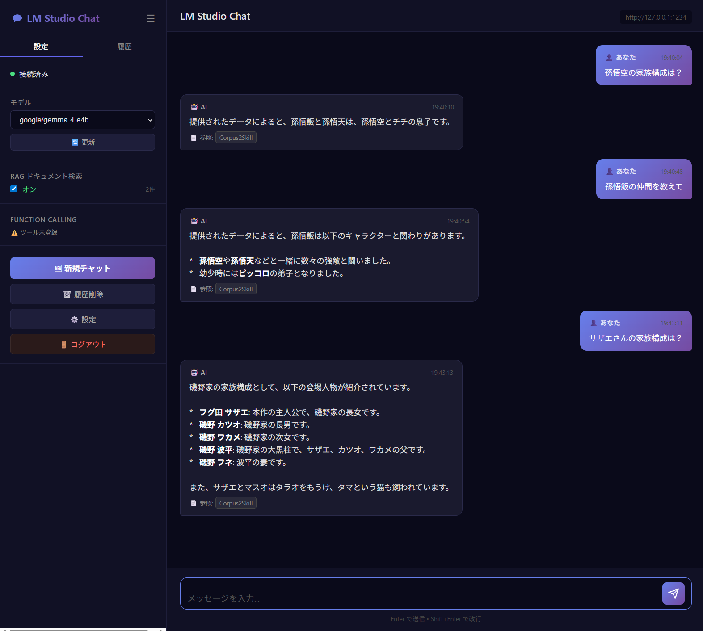
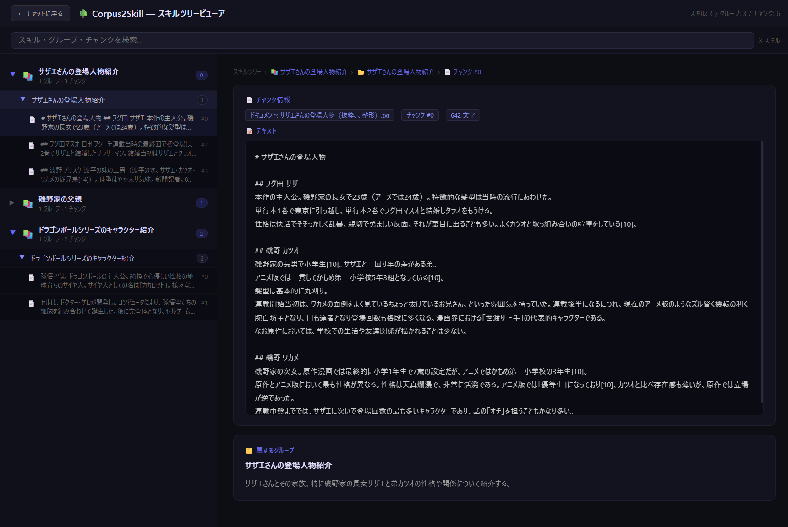
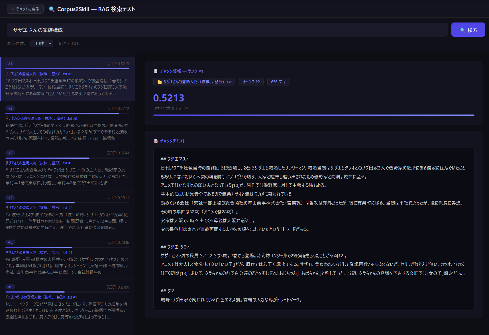

# LMStudio Chat — Corpus2Skill

LM Studio のローカル LLM に接続するチャットアプリです。  
独自の階層型 RAG システム **Corpus2Skill** と、会話を記憶する **mem0 メモリ機能** を搭載しています。

---

## スクリーンショット

### チャット画面


ツール呼び出し（Function Calling）と RAG によるコンテキスト付き会話ができます。  
サイドバーでモデルの切り替えや RAG の有効/無効を管理できます。

---

### スキルツリービューア


RAG コーパスから自動生成されたスキルツリーを階層的に閲覧できます。  
スキル → グループ → チャンク の 3 段階で構造が可視化され、チャンクを選択するとテキスト全文を確認できます。

---

### RAG 検索テスト


クエリを入力してリアルタイムにチャンク検索が行えます。  
コサイン類似度スコアとスコアバーで各チャンクの関連度を視覚的に確認できます。

---

## 主な機能

| 機能 | 説明 |
|------|------|
| 💬 ストリーミングチャット | SSE によるリアルタイムストリーミング応答 |
| 🔧 Function Calling | MCP 経由のツール呼び出し |
| 📚 Corpus2Skill RAG | テキストコーパスから階層型スキルツリーを自動構築 |
| 🌳 スキルツリービューア | RAG の内部構造を視覚的に確認 (`/skill-tree`) |
| 🔍 RAG 検索テスト | クエリのベクトル検索とスコア確認 (`/rag-search`) |
| ⚙️ バックグラウンドコンパイル | コーパス追加時に非同期でスキルツリーを構築・進捗表示 |
| 🗑️ ドキュメント個別削除 | 登録済みコーパスをドキュメント単位で削除 |
| 🛠️ スキル設定 UI | スキル数・グループ数・チャンク文字数をブラウザから調整・再コンパイル |
| 🧠 会話メモリ (mem0) | 会話内容をセッションをまたいで記憶し、次回の応答に自動反映 |

---

## 会話メモリ機能 (mem0)

[mem0](https://github.com/mem0ai/mem0) を使った永続メモリ機能です。チャットのたびにユーザーの発言と AI の回答を自動的に保存し、次回以降の会話で関連する記憶をシステムプロンプトへ注入します。

### 動作フロー

```
チャット送信
    │
    ▼  mem0 で過去の関連メモリを検索（ベクトル類似度）
    │
    ▼  ヒットしたメモリをシステムプロンプトに注入
    │
    ▼  LM Studio へ送信 → 応答取得
    │
    ▼  今回の会話（質問＋回答）をメモリに保存
```

### 特徴

- **ローカル完結** — 埋め込みは SentenceTransformer、ベクトルストアは Qdrant（ローカルファイル）を使用。外部 API は不要
- **LLM 非依存の保存方式** (`infer=False`) — ローカルモデルの JSON 出力能力に依存せず、会話テキストをそのまま埋め込んで保存するため、どのモデルでも確実に動作
- **セッションをまたいだ記憶** — ログインし直してもメモリは保持される
- **メモリタブで管理** — サイドバーの「🧠 メモリ」タブで蓄積済みメモリの一覧表示・個別削除・全削除が可能

### 設定

| 環境変数 | デフォルト | 説明 |
|---------|-----------|------|
| `C2S_EMBED_MODEL` | `sentence-transformers/paraphrase-multilingual-MiniLM-L12-v2` | 埋め込みモデル（RAG と共有） |

> **注意**: 埋め込みモデルを変更した場合は `mem0_db/` フォルダを削除してサーバーを再起動してください（次元数不一致エラーを防ぐため）。

---

## Corpus2Skill について

Corpus2Skill は、テキストコーパスを **スキルツリー** として構造化する独自の階層型 RAG システムです。

```
コーパス（テキストファイル群）
    │
    ▼  SentenceTransformer でチャンク化＋埋め込み
    │
    ▼  K-means クラスタリング（第 1 層: スキル）
    │
    ▼  各スキル内でさらに K-means（第 2 層: グループ）
    │
    ▼  LLM でスキル名・グループ名・トピックを自動生成
    │
    ▼  スキルツリー完成 → 検索時に階層的にコンテキストを取得
```

### パラメータ

| パラメータ | デフォルト | 説明 |
|-----------|-----------|------|
| `max_top_skills` | 6 | 第 1 層のスキル数 |
| `branching_factor` | 4 | 各スキル内のグループ数 |
| `chunk_max_chars` | 800 | 1 チャンクの最大文字数 |

---

## 必要環境

- **Python 3.11+**（[uv](https://docs.astral.sh/uv/) 推奨）
- **LM Studio** — ローカルで LLM を起動しておく
- **MCP サーバー**（任意） — Function Calling を使う場合

---

## セットアップ

### 1. リポジトリのクローン

```bash
git clone https://github.com/TakkunRed/LMStudio-Chat-Corpus2Skill.git
cd LMStudio-Chat-Corpus2Skill
```

### 2. 依存パッケージのインストール

```bash
uv sync
```

### 3. 環境変数の設定

`.env` ファイルをプロジェクトルートに作成します。

```env
# LM Studio の API エンドポイント（デフォルト）
LMS_BASE_URL=http://localhost:1234/v1

# 使用するモデル名（LM Studio でロードしているモデル）
LMS_MODEL=google/gemma-3-4b

# MCP サーバー設定（任意）
MCP_SERVER_URL=http://localhost:8000/mcp
```

### 4. アプリの起動

```bash
uv run python main.py
```

ブラウザで `http://localhost:8021` を開きます。

---

## 使い方

### コーパスの登録

1. 右上の **設定（⚙️）** を開く
2. **RAGドキュメント** セクションでテキストファイル（`.txt` / `.md`）をアップロード
3. アップロード後、バックグラウンドでスキルツリーのコンパイルが始まります（進捗バーで確認）

### RAG チャット

- サイドバーの **RAG** トグル（デフォルト ON）でチャットにコンテキストを付与します
- モデルは LM Studio でロードしているものに合わせてサイドバーから選択してください

### 会話メモリの使い方

- サイドバーの **🧠 会話メモリ** トグル（デフォルト ON）で有効になります
- チャットするたびに質問と回答が自動保存され、次回以降の会話に反映されます
- **🧠 メモリ** タブでメモリ一覧を確認・削除できます
- メモリをリセットしたい場合は「🗑️ 全削除」ボタンを使用してください

### スキルツリーの確認

- ヘッダーの **🌳 スキルツリービューア** ボタン、または `/skill-tree` を直接開きます
- ツリーをクリックしてスキル→グループ→チャンクを展開できます
- 検索バーでキーワードフィルタリングも可能です

### RAG 検索のテスト

- 設定の **🔍 RAG 検索テスト** ボタン、または `/rag-search` を直接開きます
- クエリを入力して **検索** を押すと、コサイン類似度順にチャンクが表示されます

### スキル設定の調整

設定モーダルの **スキルツリー設定** で以下を変更できます：

- **スキル数**（`max_top_skills`）: コーパスを何個の大分類にまとめるか
- **グループ数**（`branching_factor`）: 各スキルを何個のサブグループにまとめるか
- **チャンク文字数**（`chunk_max_chars`）: 1チャンクに含める最大文字数

変更後は **🔄 再コンパイル** ボタンを押してスキルツリーを再構築します。

---

## ディレクトリ構成

```
LMStudio-Chat-Corpus2Skill/
├── main.py                  # FastAPI アプリ本体
├── rag.py                   # Corpus2Skill RAG エンジン
├── static/
│   └── style.css            # グローバルスタイル
├── templates/
│   ├── chat.html            # チャット UI
│   ├── skill_tree.html      # スキルツリービューア
│   └── rag_search.html      # RAG 検索テスト UI
├── c2s_db/                  # RAG データ（自動生成）
│   ├── corpus/              # 元コーパステキスト
│   ├── chunks/              # チャンク JSON
│   ├── embeddings/          # ベクトル埋め込み
│   └── skills/              # スキルツリー構造
│       └── skill_XX_topic/
│           └── group_XX_sub/
│               ├── SKILL.md
│               ├── INDEX.md
│               └── chunk_ids.json
├── mem0_db/                 # メモリ用 Qdrant DB（自動生成）
├── images/                  # README 用スクリーンショット
├── .env                     # 環境変数（要作成）
└── README.md
```

> **RAG データの完全リセット**: `c2s_db/` フォルダを削除するか、設定モーダルの **🗑️ 全クリア** ボタンを使用してください。  
> **メモリの完全リセット**: `mem0_db/` フォルダを削除するか、サイドバーの「🧠 メモリ」タブの **🗑️ 全削除** ボタンを使用してください。

---

## 技術スタック

| コンポーネント | 技術 |
|--------------|------|
| Web フレームワーク | [FastAPI](https://fastapi.tiangolo.com/) + [Starlette](https://www.starlette.io/) |
| ストリーミング | Server-Sent Events (SSE) |
| LLM クライアント | [httpx](https://www.python-httpx.org/) (async streaming) |
| 埋め込みモデル | [SentenceTransformer](https://www.sbert.net/) (`paraphrase-multilingual-MiniLM-L12-v2`) |
| クラスタリング | scikit-learn K-means |
| LLM バックエンド | [LM Studio](https://lmstudio.ai/) (OpenAI 互換 API) |
| ツール呼び出し | MCP (Model Context Protocol) |
| 会話メモリ | [mem0ai](https://github.com/mem0ai/mem0) + Qdrant（ローカルファイルモード） |

---

## ライセンス

MIT
